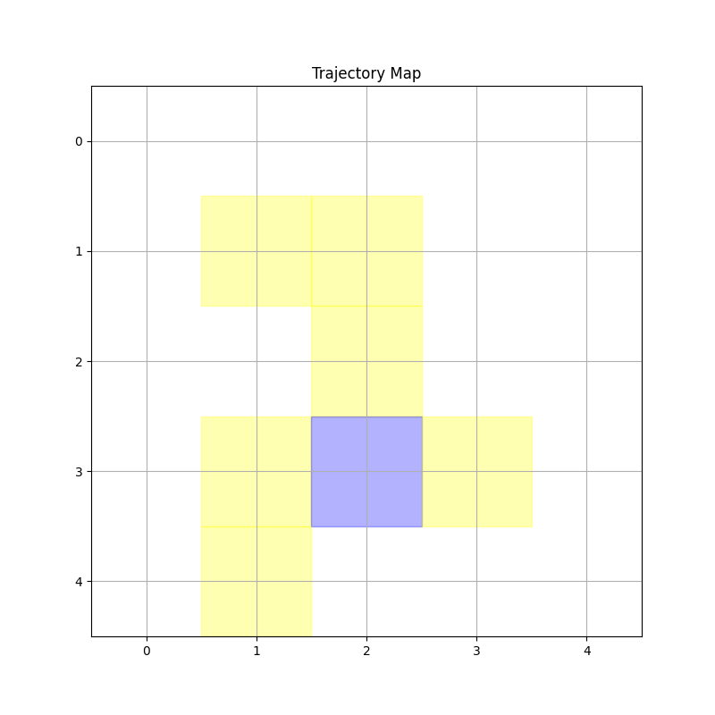
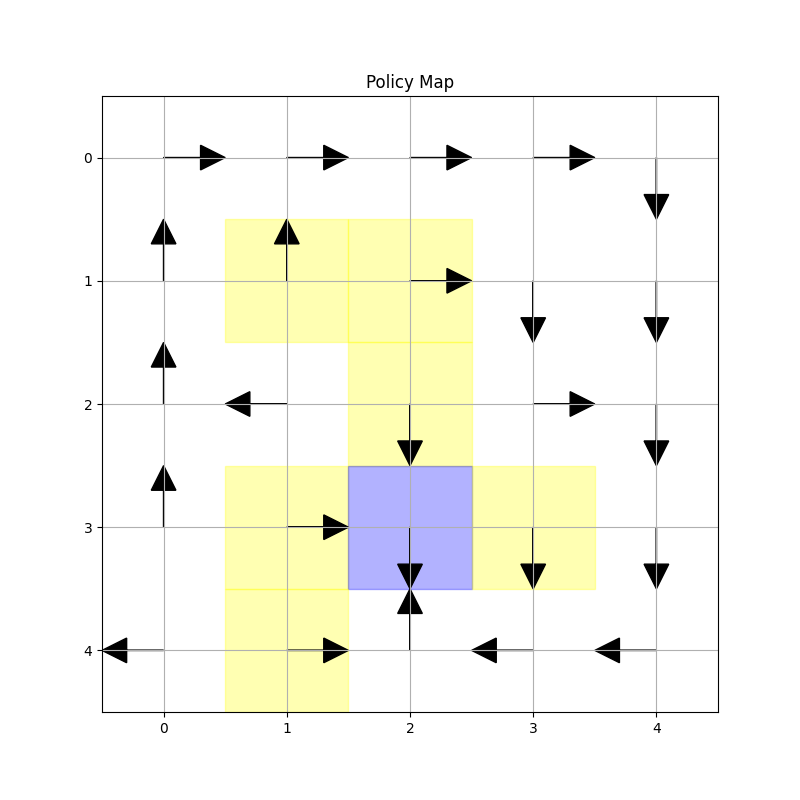
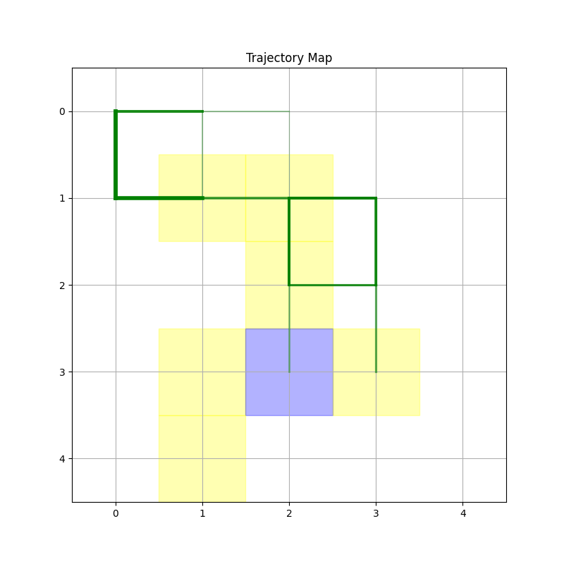
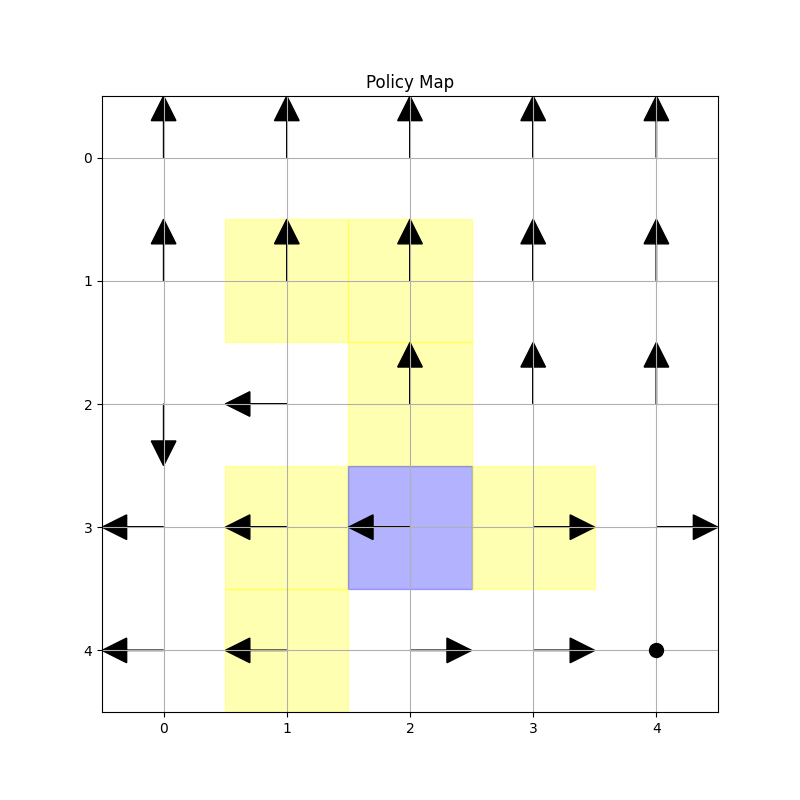

# Grid World Deep Q-Learning | 网格世界深度 Q 学习

[English](#english) | [中文](#chinese)

# <a name="english"></a>English

This is an implementation of Deep Q-Learning for solving a 5x5 grid world problem.

## Problem Description

In a 5×5 grid world, an agent needs to learn the optimal path from start to goal. The environment features:
- Starting point at (0,0)
- Goal reward = 1
- Forbidden area reward = -1
- Other areas reward = 0
- Available actions: up, down, left, right, stay

Reward Matrix:
```
[0, 0, 0, 0, 0]
[0, -1, -1, 0, 0]
[0, 0, -1, 0, 0]
[0, -1, 1, -1, 0]
[0, -1, 0, 0, 0]
```

Settings:
- `r_forbidden = r_boundary = -10` (reward for hitting boundary or forbidden area)
- `r_target = 1` (reward for reaching goal)
- `r_otherstep = 0` (reward for other steps)
- `γ = 0.9` (discount factor)

## Training Details

- Uses Deep Q-Learning (off-policy version)
- Exploration policy: π(a|s) = 0.2 (uniform random selection)
- Episode length: 1000 steps (or 100 steps for short version)
- Batch size: 100
- Neural network structure:
  - Single hidden layer with 100 neurons
  - 3 inputs: normalized row index, column index, and action index
  - 1 output: estimated action value

## Installation

```bash
pip install numpy torch matplotlib seaborn
```

For GPU support:
```bash
pip3 install torch torchvision torchaudio --index-url https://download.pytorch.org/whl/cu124
```

## Usage

Run the main program:
```bash
python grid_world_dql.py
```

The program offers two training modes:
1. 1000-step training (default mode)
2. 100-step training (short mode)

## Output

The program generates:
1. Trajectory visualization (trajectory.png)
   - Blue: goal area
   - Yellow: forbidden areas
   - Green lines: agent trajectories (thickness and shade indicate visit frequency)

2. Policy visualization (policy.png)
   - Arrows: optimal action directions
   - Circles: stay actions

3. TD error plot (td_error.png)
4. State value error plot (state_value_error.png)

### Results Visualization | 可视化结果

#### 1000-step Training Results | 1000步训练结果

<div align="center">
<table>
<tr>
<td></td>
<td></td>
</tr>
<tr>
<td align="center">Trajectory Map | 轨迹图</td>
<td align="center">Policy Map | 策略图</td>
</tr>
<tr>
<td></td>
<td></td>
</tr>
<tr>
<td align="center">TD Error | TD误差</td>
<td align="center">State Value Error | 状态值误差</td>
</tr>
</table>
</div>

#### 100-step Training Results | 100步训练结果

<div align="center">
<table>
<tr>
<td></td>
<td></td>
</tr>
<tr>
<td align="center">Trajectory Map | 轨迹图</td>
<td align="center">Policy Map | 策略图</td>
</tr>
<tr>
<td></td>
<td></td>
</tr>
<tr>
<td align="center">TD Error | TD误差</td>
<td align="center">State Value Error | 状态值误差</td>
</tr>
</table>
</div>

## License | 许可证

This project is licensed under the MIT License - see the [LICENSE](LICENSE) file for details

本项目采用 MIT 许可证 - 查看 [LICENSE](LICENSE) 文件了解详细信息

---

# <a name="chinese"></a>中文

这是一个使用深度 Q 学习解决 5x5 网格世界问题的实现。

## 问题描述

在 5×5 网格世界中，智能体需要学习从起点到达目标点的最优路径。环境特点：
- 起点位于 (0,0)
- 目标点奖励为 1
- 禁止区域奖励为 -1
- 其他区域奖励为 0
- 可用动作：上、下、左、右、不动

奖励矩阵：
```
[0, 0, 0, 0, 0]
[0, -1, -1, 0, 0]
[0, 0, -1, 0, 0]
[0, -1, 1, -1, 0]
[0, -1, 0, 0, 0]
```

参数设置：
- `r_forbidden = r_boundary = -10`（碰到边界或禁区的奖励）
- `r_target = 1`（到达目标区域的奖励）
- `r_otherstep = 0`（其他步的奖励）
- `γ = 0.9`（折扣因子）

## 训练细节

- 使用深度 Q 学习（off-policy 版本）
- 探索策略：π(a|s) = 0.2（均匀随机选择）
- Episode 长度：1000 步（或 100 步短版本）
- 批量大小：100
- 神经网络结构：
  - 单隐藏层（100 个神经元）
  - 3 个输入：归一化的行索引、列索引和动作索引
  - 1 个输出：估计的动作值

## 安装

```bash
pip install numpy torch matplotlib seaborn
```

如需 GPU 支持：
```bash
pip3 install torch torchvision torchaudio --index-url https://download.pytorch.org/whl/cu124
```

## 使用方法

运行主程序：
```bash
python grid_world_dql.py
```

程序提供两种训练模式：
1. 1000 步训练（默认模式）
2. 100 步训练（短训练模式）

## 输出结果

程序生成以下可视化结果：
1. 轨迹可视化（trajectory.png）
   - 蓝色：目标区域
   - 黄色：禁止区域
   - 绿色线条：智能体轨迹（线条粗细和颜色深浅表示访问频率）

2. 策略可视化（policy.png）
   - 箭头：最优动作方向
   - 圆圈：原地不动

3. TD 误差图（td_error.png）
4. 状态值误差图（state_value_error.png）

### Results Visualization | 可视化结果

#### 1000-step Training Results | 1000步训练结果

<div align="center">
<table>
<tr>
<td></td>
<td></td>
</tr>
<tr>
<td align="center">Trajectory Map | 轨迹图</td>
<td align="center">Policy Map | 策略图</td>
</tr>
<tr>
<td></td>
<td></td>
</tr>
<tr>
<td align="center">TD Error | TD误差</td>
<td align="center">State Value Error | 状态值误差</td>
</tr>
</table>
</div>

#### 100-step Training Results | 100步训练结果

<div align="center">
<table>
<tr>
<td></td>
<td></td>
</tr>
<tr>
<td align="center">Trajectory Map | 轨迹图</td>
<td align="center">Policy Map | 策略图</td>
</tr>
<tr>
<td></td>
<td></td>
</tr>
<tr>
<td align="center">TD Error | TD误差</td>
<td align="center">State Value Error | 状态值误差</td>
</tr>
</table>
</div>

## License | 许可证

This project is licensed under the MIT License - see the [LICENSE](LICENSE) file for details

本项目采用 MIT 许可证 - 查看 [LICENSE](LICENSE) 文件了解详细信息
